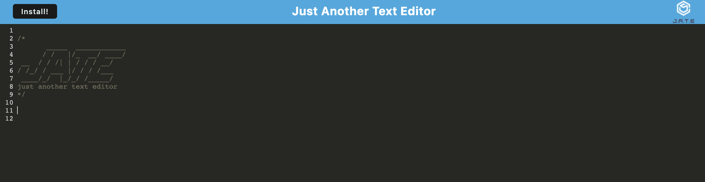

# Text Editor

    
## Description

Text editor is a web application that runs on the browser. It  is one page and meets PWA criteria. It utilizes local storage and IndexedDB for data persistance. The text editor can be downloaded and used offline as well.

Heroku link: https://stormy-wildwood-40521.herokuapp.com/

## Table of Contents

* [Installation](#installation)
* [Usage](#usage)
* [Credits](#credits)
* [License](#license)
* [Contributing](#contributing)
* [Tests](#tests)
* [Questions](#questions)

## Installation

To use you will need to install express.js, concurrently, and nodemon. To install all the dependencies, run "npm install" and then "npm run build" to initiate webpack "dist" folder. Then run "npm start" in terminal to start using the app from the code editor. Or, use the app by visiting https://stormy-wildwood-40521.herokuapp.com/ which can also be installed there. 

## Usage

To use text editor, it can be used in a web browser or downloaded and used online offline. You will need to install it using express, webpack, IndexedDB api, javascript, and a web browser.

## License

This is covered under the MIT license. 

## Questions

### Github Username
mardill: [https://github.com/mardill](https://github.com/mardill)

     
